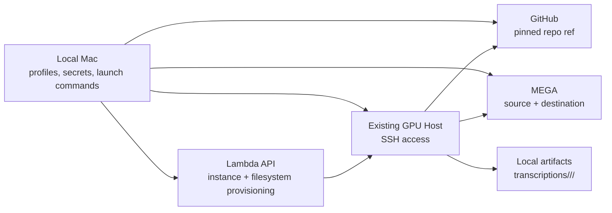

# First-Time Operator Launch Guide

This guide is for operators launching the transcription pipeline for the first
time from a local Mac.

It explains:

- how GPU provisioning works on Lambda
- which launcher to use for each situation
- which credentials stay on the Mac versus get passed to the worker
- how GitHub, MEGA, and optional S4 fit into the launch flow
- how to verify that the worker is actually running

## What Runs Where

The local Mac is the control plane.

- it holds your saved profile
- it resolves secrets such as GitHub and MEGA credentials
- it can provision a Lambda GPU worker
- it starts the remote run over SSH
- it collects manifests and artifacts back into `transcriptions/`

The remote GPU worker does the heavy work.

- it bootstraps the repo from GitHub at a pinned git ref
- it prepares a Python runtime and model cache
- it connects to MEGA
- it downloads source files, transcribes or extracts them, and uploads outputs



## Pick The Right Launcher

There are three main entry points:

### `tools/run_transcription_job.sh`

Use this when you want the repo to provision or reuse Lambda infrastructure for
you.

This script:

1. loads a saved profile
2. resolves the git ref and repo URL
3. picks compute with `tools/lambda_compute_selector.py` unless you override it
4. creates or reuses a Lambda filesystem
5. launches a Lambda instance with `tools/lambda_api_manager.sh`
6. waits for the instance IP
7. hands off to `tools/run_on_lambda_host.sh`
8. terminates the instance after the run unless `--keep-instance` is set

Use this as the default first-time path when you do not already have a worker.

### `tools/run_saved_profile.sh`

Use this when you already know the worker host and want a simpler wrapper that
reads defaults from the profile.

This is the easiest entry point for repeated runs against an existing worker.

### `tools/run_on_lambda_host.sh`

Use this only when you want direct control over:

- host IP
- SSH key
- source flags
- git ref
- runtime flags

This is the debugging and manual-override entry point.

## Before Your First Launch

### 1. Clone the repo locally

```bash
git clone https://github.com/arjunm-oa/transcription-pipeline-skill.git
cd transcription-pipeline-skill
```

### 2. Make sure your git ref is reachable from GitHub

The worker does not use your local checkout directly. It fetches the runtime
from GitHub during bootstrap, so the chosen ref must already exist on GitHub.

Recommended check:

```bash
git rev-parse HEAD
git push origin HEAD
```

### 3. Authenticate GitHub locally if the repo is private

Recommended path:

```bash
gh auth login
gh auth status
```

If the repo is private, the launcher should resolve a token locally and forward
it into the remote bootstrap step.

### 4. Export your Lambda API key locally

This is required only for the provisioning flow with
`tools/run_transcription_job.sh`.

```bash
export LAMBDA_API_KEY="your-lambda-api-key"
```

### 5. Export your MEGA password locally if the remote worker is not already logged in

`MEGA_EMAIL` lives in the saved profile. `MEGA_PASSWORD` is only needed when
the worker must establish a MEGA session during launch.

```bash
export MEGA_PASSWORD="your-mega-password"
```

## Create A Saved Profile

Start from [profiles/example.env](../profiles/example.env) and create your own
local profile such as `profiles/your-name.env.local`.

Minimal first-time example:

```bash
REMOTE_HOST="198.51.100.24"
REMOTE_USER="ubuntu"
SSH_KEY_PATH="/Users/you/.ssh/codex_lambda"
MEGA_EMAIL="you@example.com"

GIT_REPO_URL="https://github.com/arjunm-oa/transcription-pipeline-skill.git"
DEFAULT_GIT_REF="main"
DEFAULT_RUNTIME_ROOT="/lambda_filesystem/transcription"
DEFAULT_LOCAL_OUTPUT_DIR="/Users/you/transcription-pipeline-skill/transcriptions"

DEFAULT_MEGA_SOURCE_PATH="/Courses/GenHQ"
DEFAULT_MODEL="large-v3"
DEFAULT_FORCE="0"
```

Useful additions:

```bash
DEFAULT_COMPUTE_PROFILE="transcription"
DEFAULT_SELECTION_POLICY="speed-first"
DEFAULT_PREFERRED_REGIONS="us-east-3,us-east-1"

GITHUB_TOKEN_REQUIRED="1"
GITHUB_TOKEN_COMMAND="gh auth token"
```

If you are using `tools/run_transcription_job.sh`, also add the provisioning
defaults you want:

```bash
DEFAULT_FILESYSTEM_NAME="transcription-us-east-1"
DEFAULT_INSTANCE_TYPE="gpu_1x_a10"
DEFAULT_REGION="us-east-1"
```

## Credential Map

This is the main mental model to keep straight during launch.

| Value | Where it lives first | Required for | Passed to worker? | Notes |
| --- | --- | --- | --- | --- |
| `LAMBDA_API_KEY` | Local env | Lambda provisioning | No | Used only by `tools/lambda_api_manager.sh` on the Mac |
| `SSH_KEY_PATH` | Saved profile | SSH access to worker | No | Used by the Mac to connect to the worker |
| `MEGA_EMAIL` | Saved profile | Remote MEGA login | Yes | Exported during remote preflight and execute-run |
| `MEGA_PASSWORD` | Local env, command, or keychain | Remote MEGA login when session is missing | Yes, if resolved locally | The launcher resolves it locally before SSH |
| `GITHUB_TOKEN` | Local env, command, keychain, or `gh` | Private GitHub bootstrap | Yes, if resolved locally | Used during bootstrap fetch, then unset before the runner starts |
| `MEGA_S4_ACCESS_KEY` | Local env | Optional S4 staging or uploads | Yes, only when S4 is enabled | Not needed for the default MEGA-only flow |
| `MEGA_S4_SECRET_KEY` | Local env | Optional S4 staging or uploads | Yes, only when S4 is enabled | Not needed for the default MEGA-only flow |
| `GIT_REPO_URL` | Profile or CLI flag | Remote bootstrap | Yes, as a bootstrap argument | Must point to a GitHub ref the worker can fetch |
| `GIT_REF` | Profile or CLI flag | Remote bootstrap | Yes, as a bootstrap argument | Prefer a pushed commit SHA |

## How Launch Information Gets Passed To The Worker

The host runner does two major remote phases.

### Remote preflight

`tools/run_on_lambda_host.sh` connects over SSH and exports:

- `MEGA_EMAIL`
- `MEGA_PASSWORD`
- `PATH=/snap/bin:$PATH`

During preflight it checks:

- whether MEGAcmd is installed and usable
- whether a MEGA session already exists
- which attached Lambda filesystem mount is available
- which runtime root should actually be used on the worker

That is why the local run folder gets:

- `launcher-phases.log`
- `remote-preflight.log`

### Remote execute-run

For the actual run, the host runner exports:

- `MEGA_EMAIL`
- `MEGA_PASSWORD`
- `GITHUB_TOKEN` if it was resolved locally
- optional S4 credentials if S4 is enabled

Then it runs `tools/bootstrap_transcription_runtime.sh`, which:

1. fetches the repo from GitHub
2. checks out the pinned git ref into a release directory
3. builds or reuses a Python virtual environment
4. returns the resolved runner path and cache directories

After bootstrap, the host runner unsets `GITHUB_TOKEN` and starts
`tools/transcribe_mega_folder.py` with flags such as:

- source path or browser URL
- run id
- model
- compute metadata such as instance type, region, image family, architecture
- `--resolved-runtime-root`
- `--attached-volume-mount`
- `--work-dir`

This is the core handoff from local operator state to remote worker state.

## Provision A New Lambda GPU Worker

This is the recommended first-time operator path.

Basic example:

```bash
export LAMBDA_API_KEY="your-lambda-api-key"
export MEGA_PASSWORD="your-mega-password-if-needed"

bash tools/run_transcription_job.sh \
  --profile profiles/your-name.env.local \
  --mega-source-path "/Course Folder" \
  --git-ref "$(git rev-parse HEAD)"
```

What happens during provisioning:

1. the script loads the profile
2. it resolves the compute target, either automatically or from your overrides
3. it creates or reuses the configured Lambda filesystem
4. it launches the instance
5. it polls until the instance reports a public IP
6. it starts the host-runner flow against that worker
7. it terminates the instance at the end unless `--keep-instance` is set

Useful overrides:

```bash
bash tools/run_transcription_job.sh \
  --profile profiles/your-name.env.local \
  --mega-source-path "/Course Folder" \
  --compute-profile transcription \
  --selection-policy speed-first \
  --preferred-regions us-east-3,us-east-1 \
  --image-family lambda-stack \
  --architecture arm64 \
  --git-ref "$(git rev-parse HEAD)"
```

If you want to keep the instance alive after the run for debugging:

```bash
bash tools/run_transcription_job.sh \
  --profile profiles/your-name.env.local \
  --mega-source-path "/Course Folder" \
  --git-ref "$(git rev-parse HEAD)" \
  --keep-instance
```

Only use `--keep-instance` deliberately because billing continues until you
terminate the instance.

## Launch Against An Existing Worker

If you already have a GPU host and want the simplest operator path:

```bash
export MEGA_PASSWORD="your-mega-password-if-needed"

bash tools/run_saved_profile.sh \
  --profile profiles/your-name.env.local \
  --mega-source-path "/Course Folder"
```

From a browser folder URL:

```bash
bash tools/run_saved_profile.sh \
  --profile profiles/your-name.env.local \
  --mega-browser-folder-url "https://mega.nz/fm/your-folder-id"
```

For full manual control:

```bash
bash tools/run_on_lambda_host.sh \
  --profile profiles/your-name.env.local \
  --host 203.0.113.24 \
  --user ubuntu \
  --ssh-key /Users/you/.ssh/codex_lambda \
  --mega-source-path "/Course Folder" \
  --git-ref "$(git rev-parse HEAD)" \
  --git-repo-url "$(git remote get-url origin)" \
  --local-output-dir transcriptions
```

## First Launch Walkthrough

This is a practical copy-paste sequence for a new operator using provisioning.

### 1. Verify GitHub auth

```bash
gh auth status
```

### 2. Export the required local secrets

```bash
export LAMBDA_API_KEY="your-lambda-api-key"
export MEGA_PASSWORD="your-mega-password-if-needed"
```

### 3. Make sure your git ref is pushed

```bash
git rev-parse HEAD
git push origin HEAD
```

### 4. Launch

```bash
bash tools/run_transcription_job.sh \
  --profile profiles/your-name.env.local \
  --mega-source-path "/Course Folder" \
  --git-ref "$(git rev-parse HEAD)"
```

### 5. Watch the local run folder

The launcher writes artifacts under:

```text
transcriptions/<source-label>/<run-id>/
```

Look for:

- `launcher-phases.log`
- `remote-preflight.log`
- `remote-exec.log`
- `run-manifest-<run-id>.json`
- copied downloads under `downloads/`

## Monitor And Verify

### Monitor the worker

Snapshot:

```bash
bash tools/monitor_lambda_host.sh \
  --profile profiles/your-name.env.local \
  --mode snapshot
```

Split view:

```bash
bash tools/monitor_lambda_host.sh \
  --profile profiles/your-name.env.local \
  --mode split
```

### Check whether the runner is active

```bash
ssh -i /Users/you/.ssh/codex_lambda ubuntu@203.0.113.24 \
  "pgrep -af '[t]ranscribe_mega_folder.py'"
```

### Check the newest manifest locally

```bash
LATEST_MANIFEST="$(find transcriptions -name 'run-manifest-*.json' -type f | sort | tail -n1)"
python3 - <<'PY' "$LATEST_MANIFEST"
import json, sys
data = json.load(open(sys.argv[1], encoding="utf-8"))
print("status:", data.get("status"))
print("summary:", data.get("summary"))
PY
```

### Verify MEGA transcript presence vs the local mirror

```bash
python3 tools/catalog_jobs.py \
  --profile profiles/your-name.env.local \
  --db-path catalog/transcription_catalog.db \
  verify-transcripts \
  --folder-path "/Course Folder" \
  --output-dir transcriptions/_mega_mirror
```

## Common First-Run Mistakes

### Git ref is not reachable from GitHub

Symptom:

- bootstrap fails while fetching the repo

Fix:

- push the commit first
- rerun with a pushed commit SHA instead of a local-only branch state

### Private repo but no GitHub token was resolved

Symptom:

- `launcher-phases.log` shows `github_auth_ready source=none`
- `remote-exec.log` fails during `git_mirror_sync`

Fix:

- set `GITHUB_TOKEN_REQUIRED="1"` in the profile
- configure one local token source such as `GITHUB_TOKEN_COMMAND="gh auth token"`
- rerun after `gh auth status` succeeds

### `LAMBDA_API_KEY` missing

Symptom:

- provisioning fails before an instance is launched

Fix:

- export `LAMBDA_API_KEY` locally before using `tools/run_transcription_job.sh`

### `MEGA_PASSWORD` missing and the worker has no saved MEGA session

Symptom:

- remote preflight or execute-run fails during MEGA login

Fix:

- export `MEGA_PASSWORD`
- or configure `MEGA_PASSWORD_COMMAND` or Keychain lookup in the profile

### Using a browser folder URL with the wrong flag

Symptom:

- launcher rejects `mega.nz/fm/...` as a raw source link

Fix:

- use `--mega-browser-folder-url` for `mega.nz/fm/...`
- use `--mega-source-link` only for public `mega.nz/folder/...` links

### Launching a second run against the same source while one is already active

Symptom:

- duplicate work, confusing artifacts, or conflicting folder state

Fix:

- check for an active remote process first
- recover the manifest or let the first run finish before retrying

## What Gets Written Where

- Remote release checkout:
  under `<runtime-root>/releases/<git-sha>/`
- Remote virtualenv:
  under `<runtime-root>/venvs/<dependency-fingerprint>/`
- Remote run work dir:
  under `<runtime-root>/runs/<run-id>/`
- Local run artifacts:
  `transcriptions/<source-label>/<run-id>/`
- Local mirror:
  `transcriptions/_mega_mirror/<remote-folder>/...`
- Local catalog:
  `catalog/transcription_catalog.db`

## Recommended Operator Habits

- Prefer a pushed commit SHA for `--git-ref`
- Prefer `gh auth token` or Keychain over hardcoding GitHub tokens in a profile
- Keep `MEGA_PASSWORD` local when possible instead of writing it to disk
- Use `tools/run_transcription_job.sh` for first-time provisioning
- Use `tools/run_saved_profile.sh` for steady-state repeat runs on an existing worker
- Check `launcher-phases.log` and `remote-exec.log` before assuming the worker is actually transcribing
